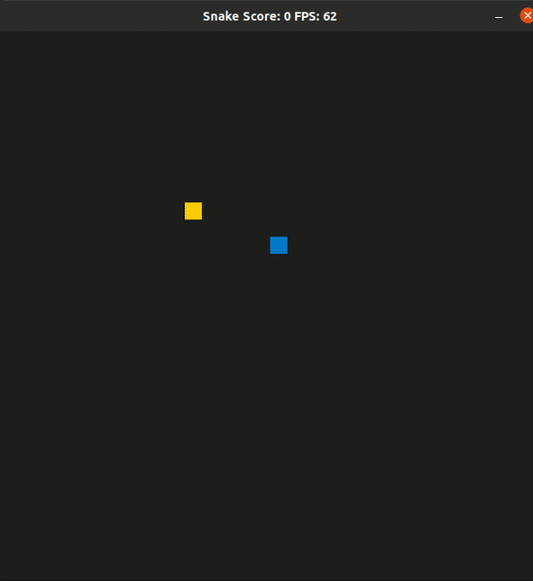

# CPPND: Capstone Snake Game Project with Special Meal Feature

This is a starter repo for the Capstone project in the [Udacity C++ Nanodegree Program](https://www.udacity.com/course/c-plus-plus-nanodegree--nd213). The code for this repo was inspired by [this](https://codereview.stackexchange.com/questions/212296/snake-game-in-c-with-sdl) excellent StackOverflow post and set of responses.

## Added Feature 
This version of snake game has extra feature that "after three successive trial to get the food ,
There is an offer called "SpecialMeal" which is similar to the normal food but it increases the score by 3 points.
But unfortunately it's limited to just 5 Seconds.
You can differs the special one as its color blinking and countdown timer appears in the title bar.

## Implementation and Changes Notes
cmake :
    1- Add the needed compiler flag "-pthread" and other flags requried by SDL2 Library

game : 
    1 - create class SpecialMealClass inherit specs from SDL_Point + timeout configuration
    2 - create Message Queue class to handle data transferring between SpecialMealInterface class and game class
    3 - create class SpecialMealInterface to handle Special Meal proccess in a parallel thread
        has a unique pointer to SpecialMealClass to control the allocation and de allocation of the object in heap.
    4 - add future instance as private member , which is used to trigger the concurrent processing.
    5 - add grid_height , grid_width as a members in the game object 
    6 - add LunchTime flag as new private member in game object
    7 - add the needed implementation in update method of the game to trigger 
    8 - add shared pointer to message queue class to handle the data transferring 
    9 - add OrderSpecialMeal method to trigger the concurrent processing .

render : 
    1 - overload render method to take extra parameter of SpecialMealSpecs
    2 - overload UpdateWindowTitle method to take extra parameter of SpecialMealSpecs

## Dependencies for Running Locally
* cmake >= 3.7
  * All OSes: [click here for installation instructions](https://cmake.org/install/)
* make >= 4.1 (Linux, Mac), 3.81 (Windows)
  * Linux: make is installed by default on most Linux distros
  * Mac: [install Xcode command line tools to get make](https://developer.apple.com/xcode/features/)
  * Windows: [Click here for installation instructions](http://gnuwin32.sourceforge.net/packages/make.htm)
* SDL2 >= 2.0
  * All installation instructions can be found [here](https://wiki.libsdl.org/Installation)
  >Note that for Linux, an `apt` or `apt-get` installation is preferred to building from source. 
* gcc/g++ >= 5.4
  * Linux: gcc / g++ is installed by default on most Linux distros
  * Mac: same deal as make - [install Xcode command line tools](https://developer.apple.com/xcode/features/)
  * Windows: recommend using [MinGW](http://www.mingw.org/)

## Basic Build Instructions

1. Clone this repo.
2. Make a build directory in the top level directory: `mkdir build && cd build`
3. Compile: `cmake .. && make`
4. Run it: `./SnakeGame`.

## CC Attribution-ShareAlike 4.0 International

Shield: [![CC BY-SA 4.0][cc-by-sa-shield]][cc-by-sa]

This work is licensed under a
[Creative Commons Attribution-ShareAlike 4.0 International License][cc-by-sa].

[![CC BY-SA 4.0][cc-by-sa-image]][cc-by-sa]

[cc-by-sa]: http://creativecommons.org/licenses/by-sa/4.0/
[cc-by-sa-image]: https://licensebuttons.net/l/by-sa/4.0/88x31.png
[cc-by-sa-shield]: https://img.shields.io/badge/License-CC%20BY--SA%204.0-lightgrey.svg
